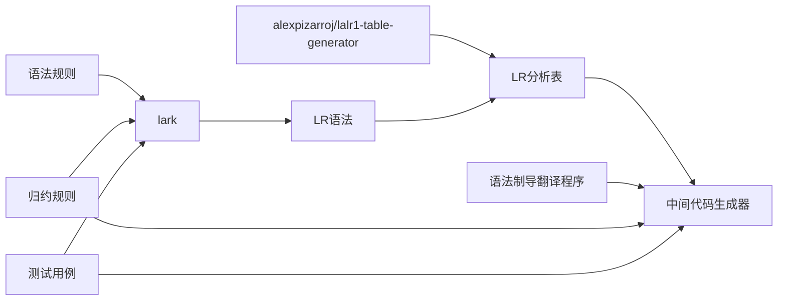
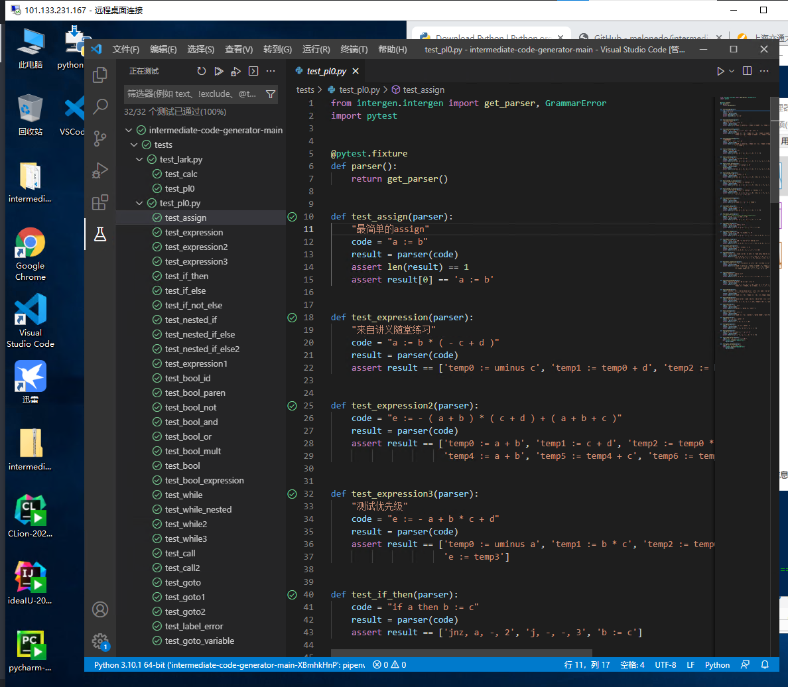
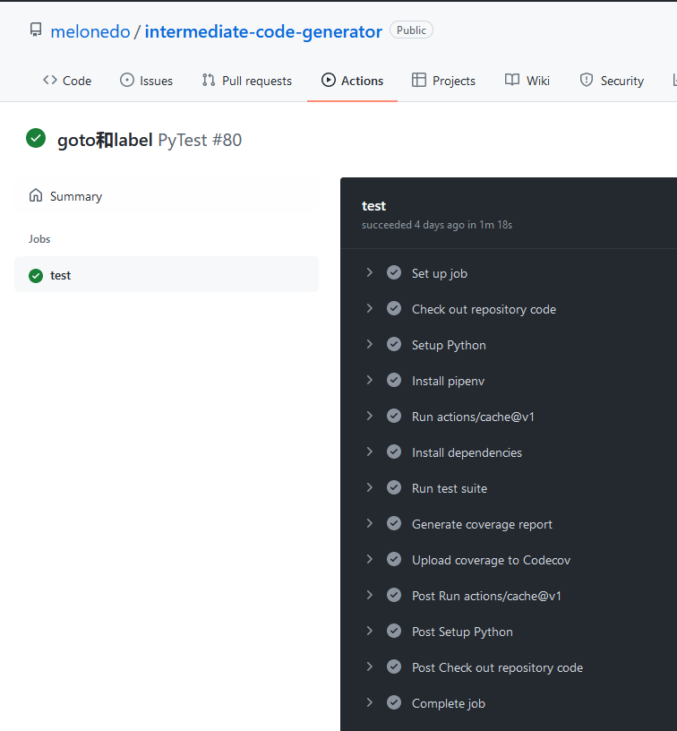
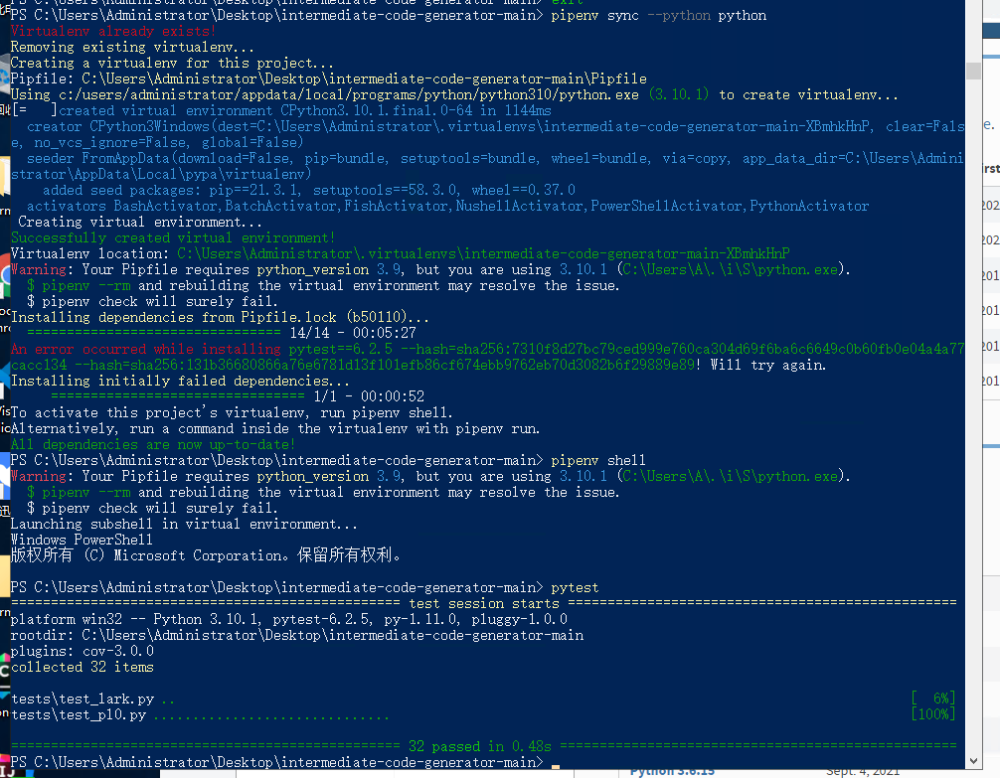

# 同济大学编译原理课程实验（模块四）实验报告

| 小组成员 | 学号      |
| ---- | ------- |
| 曾富楠  | ***REMOVED*** |
| 香宁雨  | ***REMOVED*** |
| 安江涛  | ***REMOVED*** |
| 宗佳琪  | ***REMOVED*** |
| 陈子晶  | ***REMOVED*** |

## 实验简介

本次实验要求实现中间代码生成器，即根据现有的LR分析表，搭建一个LR分析器，在自下而上归约的过程中，进行语法制导翻译，利用回填的思想，一遍扫描生成中间代码。




## 实验原理

由于实验手册中未直接给出可进行LR分析的语法，实验首先是将给出的生成式改为可通过LALR分析的无歧义语法，然后再为各个产生式编写对应的归约规则，在归约开始符号时输出中间代码。

在实验的过程中，由于直接生成LR分析表不易于确认语法的正确性，我们首先使用了python中流行的编译器框架lark进行测试，确保语法解析正确后，再改用LALR进行语法分析及中间代码的生成。

语法制导翻译基本思想: 为文法的每个产生式都配备一个语义动作或语义子程序，采用一遍扫描的处理方法，在语法分析的同时执行上述语义动作或语义子程序以此计算属性值。语义动作一方面规定了产生式产生的符号串的意义，另一方面又按照这种意义规定了生成中间代码应做的基本动作（如查填各类表格，改变编译程序某些变量的值等）。

在语法分析的过程中，每当栈顶形成句柄并使用一条产生式进行归约时，就执行相应产生式的语义动作，完成既定的翻译任务，产生中间代码，从而实现语义处理。

## 分析与实现

### 相关功能函数

在生成中间代码的过程之前，需要先一些辅助的功能函数：`emit`, `lookup`, `newtemp`, `makelist`, `merge`,  `backpatch`。

- `emit`：生成一句四元式，将此四元式存储在codes变量中。
- `lookup`：在符号表中查找符号对应的变量，要注意的是，由于没有翻译说明语句，在表达式生成中用到的变量都在调用`lookup`的时候加入符号表，并设置类型为“变量”，以区别于在标志符和goto翻译过程中添加的符号（类型为“符号”）。
- `newtemp`：生成一个临时变量，为了每次生成不同的临时变量，我们设置了一个计数器，时生成的临时变量名从`temp1`, `temp2`, ...依次生成。
- `makelist`：生成一个链表，由于在python中实现链表较为复杂，我们直接使用列表实现。
- `merge`：合并两个链表。
- `backpatch`：将链表中对应的跳转指令最后的目标地址占位符0改为已知的目标地址。

### 赋值语句的翻译

```
expression: negative                    -> expression_num
    | expression "+" term               -> expression_add
negative: term                          -> expression_num 
    | "-" term                          -> expression_negative     
term: factor                            -> expression_num
    | term "*" factor                   -> expression_mutiply
factor: id                              -> expression_id
    | num                               -> expression_num
    | "(" expression ")"                -> expression_brackets
```

赋值语句的翻译前需要首先根据优先级和结合关系编写语法。除了简单的赋值语句以外还包括表达式的计算及赋值，其中优先级为括号`()`>`*`>负号`-`>加法`+`，为实现优先级的表示，我们采用不同的表达式表示语句，并且以表达式的嵌套关系实现优先级。

### 布尔表达式的翻译

布尔表达式的语法为

```
b_expr: b_and                    -> bool_trans
    | b_expr "or"i m b_and       -> bool_or

b_and: b_not                     -> bool_trans
    | b_and "and"i m b_not       -> bool_and

b_not: b_comparison              -> bool_trans
    | "not"i b_not               -> bool_not

b_comparison: expression relop expression  -> bool_expression_relop_expression
    | expression                           -> bool_expression
    | "(" b_expr ")"                       -> bool_trans
m:
```

布尔表达式的翻译和赋值语句类似，需要首先根据优先级和结合关系编写语法，然后加入归约子程序。要注意的是，为了使得布尔表达式可以和赋值语句中的算术表达式同时存在于同一语句中，且在条件语句等中将布尔表达式与算术表达式区别，需要为布尔表达式使用单独的符号b_expr，而不是算术表达式的expression。

### 条件语句的翻译

条件语句的语法为

```
stmt: s | open_stmt
s:  "if"i b_expr "then"i m s n "else"i m s   -> s_if_else
open_stmt: "if"i b_expr "then"i m stmt               -> s_if
    | "if"i b_expr "then"i m s n "else"i m open_stmt -> s_if_else_open
m:
n:
```

和赋值语句类似，实验手册中给出的语法在`if ... else if ...`类型的语句中有歧义，解决的方法是修改语法使得`if`总是匹配到最近的`else`。

### 循环语句的翻译

循环语句的语法为

```
s:  "while"i m b_expr "do"i m s            -> s_while
m:
```

循环语句的翻译在布尔表达式语句的基础上进行，设置两个m以方便回填。

### 标号和goto语句的翻译

标号和goto语句的语法为

```
s:     "{" l "}"                                  -> s_brackets
        | label s                                 -> s_label_s
        | "goto"i id                              -> s_goto

label: id ":"                                      -> s_label
l:      l ";" m s                                  -> s_semicolon
        | s                                        -> s_semicolon_s
```

为保证标号语句和goto语句能够同时进行测试，加入了";"和"{}"的语法规则，同时设置m方便回填。

标号和goto语句翻译的主要难点是需要将代码中的链表的表达形式抽象出来，直接用python的list类型实现。根据观察，符号表中标号所在行的地址栏可能表示一个链表的表头，也可能表示该标号的跳转地址，而区分的条件是这个标号是否已定义。为了区分这两者，我们将跳转地址命名为place，而将待回填四元式链表命名为quad_list，这在我们的代码中也得以体现。

### 过程调用语句的翻译

过程调用语句的语法为

```
s:  "call"i id "(" e_list ")"              -> s_call
e_list: expression                          -> call_init     
        | e_list "," expression            -> call_add
```

过程调用包括传递参数和转子，翻译时把实参的地址逐一放在转子指令的前面。参数的地址存放在`e_list`中，最后对`e_list`中的每一项生成一条`param`语句。

### 基于属性文法的中间代码生成器

本项目需要实现一个自下归约的过程中生成中间代码的生成器。实现的方法是基于LR分析法的分析器，不断根据当前状态和下一符号，判断当前需要进行的动作，进行相应语法动作。

- 如果动作是移入，则在状态栈中移入新状态，并在值栈中移入当前符号的综合属性（代码中为符号本身）。
- 如果动作是归约，则根据产生式长度len，删除符号栈栈顶的len个元素，并将goto表中下一状态压入符号栈。同时把值栈栈顶的len个元素作为对应归约函数的规约函数的参数，调用该函数并将返回值压入值栈。
- 如果动作是接受，则将值栈栈顶的值作为整个中间代码分析的结果返回。
- 如果动作为其他情况则报错。

## 实验结果

本次实验为中间代码生成器编写了30个测试，另有2个语法分析器的测试，在项目环境中运行`pytest`可以得到结果为测试全部通过。



中间代码生成的结果见[附录](#附录：中间代码生成结果)

本项目将在项目结束后开源于<https://github.com/melonedo/intermediate-code-generator>

## 总结与思考

本次实验我们完整地实现了从LR解析器到中间代码生成的过程，在程序编写和测试的过程中可以直接观察到中间代码生成的全过程，深刻地理解到了一遍扫描地翻译时各个链表的作用，直观体会到了各产生式间的相互关系，加深了对编译原理的理解。

### 实验小结

#### 根据歧义语法编写适合于LR分析的语法

手册中给出的语法是基于语法树给出，并没有包括具体的表达式的优先级及左右结合关系，因此是有歧义的语法，无法生成LR分析表。本项目中根据实际运算的性质，指定了各符号的优先级和结合关系，并给出了对应的语法，生成LR分析表后可以直接用于代码。

由于编写语法的能力有限，无法完全消除代码中的歧义，这体现在布尔表达式的产生式`B -> (E)`和`E -> (E)`（省略中间的其他符号）中，括号应用的顺序不同。但由于实际上两种归约对结果没有影响，我们手动选择了后一种产生式。

#### 理解标号和goto语句翻译子程序中链表的表达

在标号和goto语句翻译子程序中，伪代码并没有明显地给出`makelist`的调用过程，而是根据链表的具体实现，在符号表中某符号的地址栏处填上链表表头，而利用四元式中跳转地址作为链表的next指针，从而实现链表。这对理解翻译子程序产生了一定的挑战，我们经过仔细分析后发现符号表中的地址栏仅在该符号已定义后才代表跳转的地址，其他时候代表待回填跳转地址的指令链表，据此编写翻译子程序。

### 实验亮点

#### 可复现性

为了保证代码可以在不同的平台和环境中稳定复现，本项目使用了pipenv进行环境管理，通过`pipenv sync`指令即可安装和实验环境完全相同的环境，并提示潜在的环境差异（如python版本、操作系统不同）。此后使用`pipenv shell`指令可以在此环境中进行代码的使用和测试。根据测试，本项目可以本地Windows环境、linux环境和项目的云平台上运行。

#### 单元测试

本次项目设计的语法规则比较复杂，每个人写的归约规则可能互相冲突，影响他人的代码的结果，因此我们在本项目编写了大量的测试，这些测试通过`pytest`指令运行，可以看到执行结果为测试全部通过。

```
PS D:\code\intermediate-code-generator> pytest
================================================= test session starts =================================================
platform win32 -- Python 3.9.1, pytest-6.2.5, py-1.11.0, pluggy-1.0.0
rootdir: D:\code\intermediate-code-generator
plugins: cov-3.0.0
collected 32 items

tests\test_lark.py ..                                                                                            [  6%]
tests\test_pl0.py ..............................                                                                 [100%]

================================================= 32 passed in 0.26s ==================================================
```

#### 持续集成

为了保证每个人的代码在提交后都经过测试，不影响他人代码，还通过GitHub Actions平台对提交的代码进行自动测试，代码在云平台上自动测试后结果可以在提交记录中查看。



#### 集成LR分析表生成器

本项目不包括生成LR分析表实验内容，因此我们在项目中集成了开源的LR分析表生成器，利用lark框架解析输入的BNF语法文本，将其转换为使用于LR分析表生成器的输入`parsing.Grammar`，进而类型生成LR分析器，用于LR语法分析。在代码中，运行tablegen.py即可根据语法生成对应的LR分析表，供LR分析器使用。

### 平台使用反馈

我们在平台上配置了环境并运行了本项目的测试，测试结果通过。



本次云平台使用的环境安装了多个IDE，配置好环境后测试代码很方便，响应速度也很快，但是没有安装常用的编程开发环境，因此本次项目每次在云平台上测试时都需要手动按照python和git，需要从网站上下载对应的安装包，比较麻烦，最好可以内置这些工具，或者在内网中提供这些工具的安装包，方便常见编程环境的搭建。

### 课程建议

本次实验所要求的实验内容为根据输入的语法树，进行自下而上的归约，在归约的过程中生成中间代码，主要考察的是正确编写归约过程中归约子程序。但实际上在进行规约子程序的编写前，要先将语法整理为可供LR分析的语法，并转换为LR分析表，这部分难度较大，需要综合利用编译原理课程中的知识，最好可以在实验前给予一定的提示。

### 小组分工与成绩权重

曾富楠：20%

香宁雨：20%

安江涛：20%

宗佳琪：20%

陈子晶：20%

## 附录：中间代码生成结果

限于篇幅，部分生成结果请参考程序的测试输出。

| 源代码                                                                                                                                                                             | 中间代码                                                                                                                                                                                                                                                                                                                                                                                                                                                                                                                                                                                                           |
| ------------------------------------------------------------------------------------------------------------------------------------------------------------------------------- | -------------------------------------------------------------------------------------------------------------------------------------------------------------------------------------------------------------------------------------------------------------------------------------------------------------------------------------------------------------------------------------------------------------------------------------------------------------------------------------------------------------------------------------------------------------------------------------------------------------- |
| a := b                                                                                                                                                                          | a := b                                                                                                                                                                                                                                                                                                                                                                                                                                                                                                                                                                                                         |
| a := b * ( - c + d )                                                                                                                                                            | temp0 := uminus c <br />temp1 := temp0 + d <br />temp2 := b * temp1 <br />a := temp2                                                                                                                                                                                                                                                                                                                                                                                                                                                                                                                           |
| e := - a + b * c + d                                                                                                                                                            | temp0 := uminus a<br />temp1 := b * c<br />temp2 := temp0 + temp1<br />temp3 := temp2 + d<br />e := temp3                                                                                                                                                                                                                                                                                                                                                                                                                                                                                                      |
| if a then b := c                                                                                                                                                                | jnz, a, -, 2<br />j, -, -, 3<br />b := c                                                                                                                                                                                                                                                                                                                                                                                                                                                                                                                                                                       |
| if a then b := c else b := d                                                                                                                                                    | jnz, a, -, 2<br />j, -, -, 4<br />b := c<br />j, -, -, 5<br />b := d                                                                                                                                                                                                                                                                                                                                                                                                                                                                                                                                           |
| if not a then b := c else b := d                                                                                                                                                | jnz, a, -, 4<br />j, -, -, 2<br />b := c<br />j, -, -, 5<br />b := d                                                                                                                                                                                                                                                                                                                                                                                                                                                                                                                                           |
| if a then if b then c := d                                                                                                                                                      | jnz, a, -, 2<br />j, -, -, 5<br />jnz, b, -, 4<br />j, -, -, 5<br />c := d                                                                                                                                                                                                                                                                                                                                                                                                                                                                                                                                     |
| if a then if b then c := d else e := f                                                                                                                                          | jnz, a, -, 2<br />j, -, -, 7<br />jnz, b, -, 4<br />j, -, -, 6<br />c := d<br />j, -, -, 7<br />e := f                                                                                                                                                                                                                                                                                                                                                                                                                                                                                                         |
| if a then if b then c := d else e := f else g := h                                                                                                                              | jnz, a, -, 2<br />j, -, -, 8<br />jnz, b, -, 4<br />j, -, -, 6<br />c := d<br />j, -, -, 9<br />e := f<br />j, -, -, 9<br />g := h                                                                                                                                                                                                                                                                                                                                                                                                                                                                             |
| a := i + j                                                                                                                                                                      | temp0 := i + j<br />a := temp0                                                                                                                                                                                                                                                                                                                                                                                                                                                                                                                                                                                 |
| if not a then c := d                                                                                                                                                            | jnz, a, -, 3<br />j, -, -, 2<br />c := d                                                                                                                                                                                                                                                                                                                                                                                                                                                                                                                                                                       |
| if not ( ( a ) ) then c := d                                                                                                                                                    | jnz, a, -, 3<br />j, -, -, 2<br />c := d                                                                                                                                                                                                                                                                                                                                                                                                                                                                                                                                                                       |
| if not a > b then c := d                                                                                                                                                        | j>, a, b, 3<br />j, -, -, 2<br />c := d                                                                                                                                                                                                                                                                                                                                                                                                                                                                                                                                                                        |
| if not a > b and c <= d then e := f                                                                                                                                             | j>, a, b, 5<br />j, -, -, 2<br />j<=, c, d, 4<br />j, -, -, 5<br />e := f                                                                                                                                                                                                                                                                                                                                                                                                                                                                                                                                      |
| if not a > b and c <= d or e <> f then g := h                                                                                                                                   | j>, a, b, 4<br />j, -, -, 2<br />j<=, c, d, 6<br />j, -, -, 4<br />j<>, e, f, 6<br />j, -, -, 7<br />g := h                                                                                                                                                                                                                                                                                                                                                                                                                                                                                                    |
| if not not not a > b then c := d                                                                                                                                                | j>, a, b, 3<br />j, -, -, 2<br />c := d                                                                                                                                                                                                                                                                                                                                                                                                                                                                                                                                                                        |
| while a < b do a := b                                                                                                                                                           | j<, a, b, 2<br />j, -, -, 4<br />a := b<br />j, -, -, 0                                                                                                                                                                                                                                                                                                                                                                                                                                                                                                                                                        |
| while a do while a do a := a + ( - a )                                                                                                                                          | jnz, a, -, 2<br />j, -, -, 9<br />jnz, a, -, 4<br />j, -, -, 0<br />temp0 := uminus a<br />temp1 := a + temp0<br />a := temp1<br />j, -, -, 2<br />j, -, -, 0                                                                                                                                                                                                                                                                                                                                                                                                                                                  |
| call f ( a , b )                                                                                                                                                                | param a<br />param b<br />call f                                                                                                                                                                                                                                                                                                                                                                                                                                                                                                                                                                               |
| call f ( a , x + y )                                                                                                                                                            | temp0 := x + y<br />param a<br />param temp0<br />call f                                                                                                                                                                                                                                                                                                                                                                                                                                                                                                                                                       |
| { l : a := b ; goto l }                                                                                                                                                         | a := b<br />j, -, -, 0                                                                                                                                                                                                                                                                                                                                                                                                                                                                                                                                                                                         |
| { d := c ; l : a := b ; goto l }                                                                                                                                                | d := c<br />a := b<br />j, -, -, 1                                                                                                                                                                                                                                                                                                                                                                                                                                                                                                                                                                             |
| { b := a ; goto l ; l : a := b }                                                                                                                                                | b := a<br />j, -, -, 2<br />a := b                                                                                                                                                                                                                                                                                                                                                                                                                                                                                                                                                                             |
| { l : a := b ; l : c := d }                                                                                                                                                     | raise grammar error                                                                                                                                                                                                                                                                                                                                                                                                                                                                                                                                                                                            |
| { a := b ; goto a }                                                                                                                                                             | raise grammar error                                                                                                                                                                                                                                                                                                                                                                                                                                                                                                                                                                                            |
| while a + b < c * d do <br />while not ( - a + b ) * c and ( d or a + b > d + e ) do <br />if not ( ( a ) ) then b := c <br />else a := - ( a + b ) * ( c + d ) + ( a + b + c ) | temp0 := a + b<br />temp1 := c * d<br />j<, temp0, temp1, 4<br />j, -, -, 29<br />temp2 := uminus a<br />temp3 := temp2 + b<br />temp4 := temp3 * c<br />jnz, temp4, -, 0<br />j, -, -, 9<br />jnz, d, -, 15<br />j, -, -, 11<br />temp5 := a + b<br />temp6 := d + e<br />j>, temp5, temp6, 15<br />j, -, -, 0<br />jnz, a, -, 19<br />j, -, -, 17<br />b := c<br />j, -, -, 4<br />temp7 := a + b<br />temp8 := c + d<br />temp9 := temp7 * temp8<br />temp10 := uminus temp9<br />temp11 := a + b<br />temp12 := temp11 + c<br />temp13 := temp10 + temp12<br />a := temp13<br />j, -, -, 4<br />j, -, -, 0 |